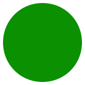
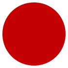



    

        <!--Body Beginning-->
        

            

            

            

            <h4 class="">The Golden parrot Mini-League</h4>
            
Lorem ipsum dolor sit amet, consectetur adipiscing elit. Aenean euismod bibendum laoreet. Proin gravida dolor sit amet lacus accumsan et viverra justo commodo.

            <h6>SELCO MINI-LEAGUE CHAMPIONSHIPS</h6>

           

        

        <h6 class="text left points-header-sidebar">Points</h6>
        <h6 class="text left points-number-sidebar">230</h6>
        <h6 class="text left points-footer-sidebar">+40 (GM3)</h6>
        
        

        

        <h6 class="text right points-header-sidebar">Position</h6>
        <h6 class="text right points-number-sidebar">2387</h6>
        <h6 class="text right points-footer-sidebar">/1299000</h6>
        
        

    

    

      

<h6 class="right-header">MANAGER</h6>

Jose Mourinho

<h6 class="right-header">COUNTRY</h6>

United Kingdom

<h6 class="right-header">PERIOD</h6>

GM1-GM35

<h6 class="right-header">TYPE</h6>

Open/Private

<h6 class="right-header">PLAYERS</h6>

35/40

<button class="lge-btn leave league-button">Leave Mini-League</button><button class="lge-btn manage league-button">Apply to Join</button>
		

             

             

<ul class="nav nav-pills center-pills-inner mini-league-pills">
<li class="first active"><a data-toggle="pill" href="#leaderboard">Leaderboard</a></li>
<li class=""><a data-toggle="pill" href="#monthly">Monthly</a></li>
<li class=""><a data-toggle="pill" href="#weekly">Weekly</a></li>
<li class=""><a data-toggle="pill" href="#newsfeed">Newsfeed</a></li>
</ul>

<label class="radio-inline"><input type="radio" name="optradio">SHOW TOP</label>
<label class="radio-inline"><input type="radio" name="optradio">SHOW MY POSITION</label>

<table class="leaderboard" width="100%" cellpadding="5">
<tbody>
<tr class="table-top-row">
  <th scope="col">POSITION</th>
  <th scope="col"></th>
  <th class="mob-hide" scope="col"></th>
  <th scope="col"></th>
  <th scope="col" class="table-centre">PLAYER NAME</th>
  <th class="mob-hide" scope="col"></th>
  <th class="mob-hide" scope="col"></th>
  <th class="mob-hide" scope="col"></th>
  <th scope="col" class="table-centre">THIS WEEK</th>
  <th scope="col" class="table-centre">POINTS</th>
  <th scope="col"></th>
</tr>
<tr class="stand-row pos-yellow">
  <td class="leaderboard-up"><i class="fa fa-chevron-circle-up"></i>1 (2)</td>
  <td class="player-name table-padding">

</td>
  <td class="mob-hide"></td>
  <td></td>
  <td class="table-centre">Juan Mata</td>
  <td class="badges mob-hide">&nbsp;</td>
  <td class="badges mob-hide"></td>
  <td class="badges mob-hide"></td>
  <td>

        <h6 class="text left points-number-sidebar table-md">+20</h6>
        
      

   </td>
  <td class="table-centre">101</td>
  <td></td>
</tr>

<tr class="stand-row">
  <td class="leaderboard-down"><i class="fa fa-chevron-circle-down"></i>2 (1)</td>
  <td class="player-name table-padding">

</td>
  <td class="mob-hide"></td>
  <td></td>
  <td class="table-centre">Jose Mourinho</td>
  <td class="badges mob-hide">&nbsp;</td>
  <td class="badges mob-hide"></td>
  <td class="badges mob-hide"></td>
  <td>

        <h6 class="text left points-number-sidebar table-md">-10</h6>
        
      

   </td>
  <td class="table-centre">101</td>
  <td></td>
</tr>

 <tr class="stand-row pos-blue">
  <td class="leaderboard-right"><i class="fa fa-chevron-circle-right"></i>3 (1)</td>
  <td class="player-name table-padding">

</td>
  <td class="mob-hide"></td>
  <td></td>
  <td class="table-centre">Phil Jones</td>
  <td class="badges mob-hide">&nbsp;</td>
  <td class="badges mob-hide"></td>
  <td class="badges mob-hide"></td>
  <td>

        <h6 class="text left points-number-sidebar table-md">-10</h6>
        
      

   </td>
  <td class="table-centre">101</td>
  <td></td>
</tr>

 <tr class="stand-row">
  <td class="leaderboard-up"><i class="fa fa-chevron-circle-up"></i>4 (8)</td>
  <td class="player-name table-padding">

</td>
  <td class="mob-hide"></td>
  <td></td>
  <td class="table-centre">Paul Pogba</td>
  <td class="badges mob-hide">&nbsp;</td>
  <td class="badges mob-hide"></td>
  <td class="badges mob-hide"></td>
  <td>

        <h6 class="text left points-number-sidebar table-md">+20</h6>
        
      

   </td>
  <td class="table-centre">101</td>
  <td></td>
</tr>

<tr class="stand-row">
  <td class="leaderboard-up"><i class="fa fa-chevron-circle-up"></i>1 (2)</td>
  <td class="player-name table-padding">

</td>
  <td class="mob-hide"></td>
  <td></td>
  <td class="table-centre">Juan Mata</td>
  <td class="badges mob-hide">&nbsp;</td>
  <td class="badges mob-hide"></td>
  <td class="badges mob-hide"></td>
  <td>

        <h6 class="text left points-number-sidebar table-md">+20</h6>
        
      

   </td>
  <td class="table-centre">101</td>
  <td></td>
</tr>

<tr class="stand-row">
  <td class="leaderboard-down"><i class="fa fa-chevron-circle-down"></i>2 (1)</td>
  <td class="player-name table-padding">

</td>
  <td class="mob-hide"></td>
  <td></td>
  <td class="table-centre">Jose Mourinho</td>
  <td class="badges mob-hide">&nbsp;</td>
  <td class="badges mob-hide"></td>
  <td class="badges mob-hide"></td>
  <td>

        <h6 class="text left points-number-sidebar table-md">-10</h6>
        
      

   </td>
  <td class="table-centre">101</td>
  <td></td>
</tr>

 <tr class="stand-row">
  <td class="leaderboard-right"><i class="fa fa-chevron-circle-right"></i>2 (1)</td>
  <td class="player-name table-padding">

</td>
  <td class="mob-hide"></td>
  <td></td>
  <td class="table-centre">Phil Jones</td>
  <td class="badges mob-hide">&nbsp;</td>
  <td class="badges mob-hide"></td>
  <td class="badges mob-hide"></td>
  <td>

        <h6 class="text left points-number-sidebar table-md">-10</h6>
        
      

   </td>
  <td class="table-centre">101</td>
  <td></td>
</tr>

 <tr class="stand-row">
  <td class="leaderboard-up"><i class="fa fa-chevron-circle-up"></i>4 (8)</td>
  <td class="player-name table-padding">

</td>
  <td class="mob-hide"></td>
  <td></td>
  <td class="table-centre">Paul Pogba</td>
  <td class="badges mob-hide">&nbsp;</td>
  <td class="badges mob-hide"></td>
  <td class="badges mob-hide"></td>
  <td>

        <h6 class="text left points-number-sidebar table-md">+20</h6>
        
      

   </td>
  <td class="table-centre">101</td>
  <td></td>
</tr>
</tbody>
</table>

<nav aria-label="Page navigation">
  <ul class="pagination">
    <li>
      <a href="#" aria-label="Previous">
        &laquo;
      </a>
    </li>
    <li class="active"><a href="#">1</a></li>
    <li><a href="#">2</a></li>
    <li><a href="#">3</a></li>
    <li><a href="#">4</a></li>
    <li><a href="#">5</a></li>
    <li>
      <a href="#" aria-label="Next">
        &raquo;
      </a>
    </li>
  </ul>
</nav>

            <!--Body Ending-->

<!--Sidebar Beginning-->

    
    
    
    <h5 class="player-name">Juan Mata</h5>

    

    <h5>Player Performance</h5><i class="fa fa-line-chart sidebar-i-right" aria-hidden="true"></i>
    

    

    

        

        <h6 class="text left points-header-sidebar">Points</h6>
        <h6 class="text left points-number-sidebar">230</h6>
        <h6 class="text left points-footer-sidebar">+40 (GM3)</h6>
        
        

        

        <h6 class="text right points-header-sidebar">Position</h6>
        <h6 class="text right points-number-sidebar">2387</h6>
        <h6 class="text right points-footer-sidebar">/1299000</h6>
        
        

    

    

    <h6 class="siderbar-sub-heading">Key Performance Indicators</h6>
    

        AVG <i class="fa fa-arrow-up fa-arrows green" aria-hidden="true"></i>
        60.5

    

    

        ACC <i class="fa fa-arrow-up fa-arrows green" aria-hidden="true"></i>
        60.5
    

    

        BNK <i class="fa fa-arrow-down fa-arrows red" aria-hidden="true"></i>
        60.5
    

    

        HI
        60.5
    

    

        LOW
        60.5
    

    <h6 class="siderbar-sub-heading">Current Banker Bonus (0/20)</h6>

    

    
    

    

    <a href="#">Performance <i class="fa fa-arrow-circle-o-right circle-right-sm" aria-hidden="true"></i></a>
    

    

    

    

    <h5>Mini Leagues</h5><i class="fa fa-file-text-o sidebar-i-right" aria-hidden="true"></i>
    

    

    

        
<a href="#">Design Team League</a><a href="#"><button class="lge-btn manage">Manage</button></a>

        
<a href="#">Golden Parrot</a><a href="#"><button class="lge-btn leave">Leave</button></a>

        
<a href="#">Wed Night Cup XI</a><a href="#"><button class="lge-btn leave">Leave</button></a>

    

    

    <a href="#">Mini Leagues <i class="fa fa-arrow-circle-o-right circle-right-sm" aria-hidden="true"></i></a>
    

    

    

    

    <h5>Gameweek 26 Review</h5><i class="fa fa-trophy sidebar-i-right" aria-hidden="true"></i>
    

    

    

        
<a href="#">Woah! What a week for Points!</a><a href="#"><i class="fa fa-arrow-circle-o-right circle-right-lg" aria-hidden="true"></i></a>

    

    

    

    

    <h5>News Feed Latest</h5><i class="fa fa-paper-plane sidebar-i-right" aria-hidden="true"></i>
    

    

    

        
<a href="#">@ZLATAN</a>Zlatan Ibrahimovic53 mins ago
        
This week rocked, I’m the best! Noone predicts like Zlatan! 

        

    

    

        
<a href="#">@THEBOSS</a>Jose Mourinho56 mins ago
        
The special one had a very special week.

        

    

    

    

    

    

    
            

<!--Sidebar End-->
